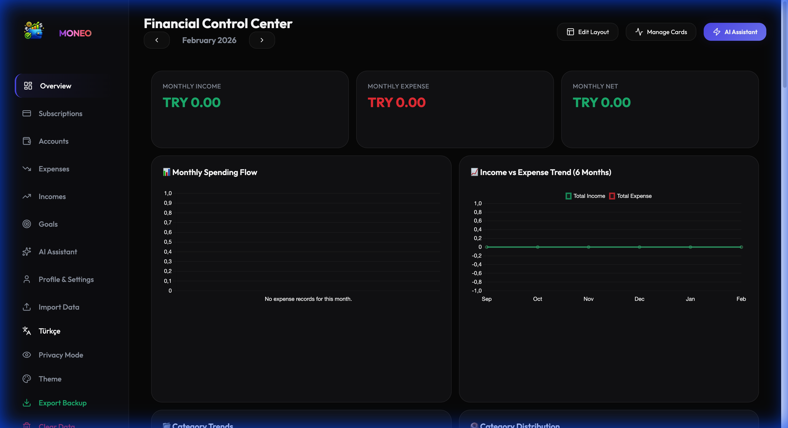
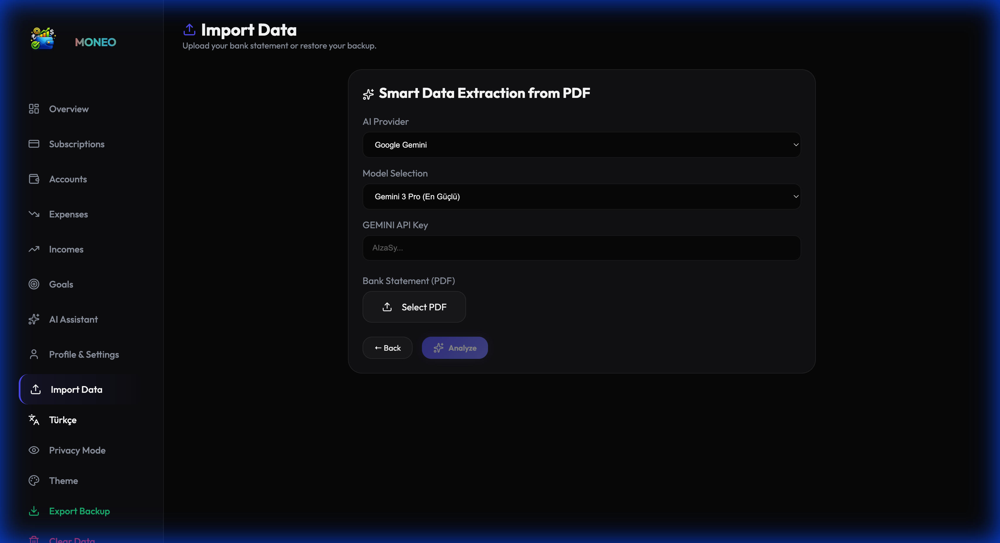
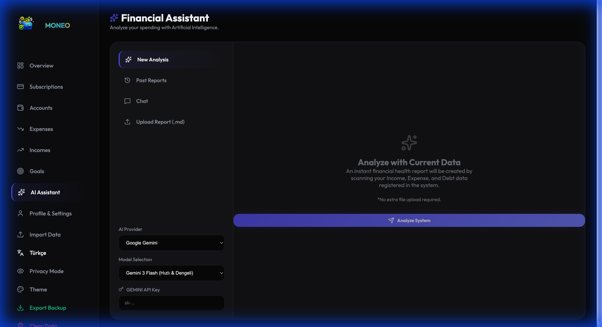
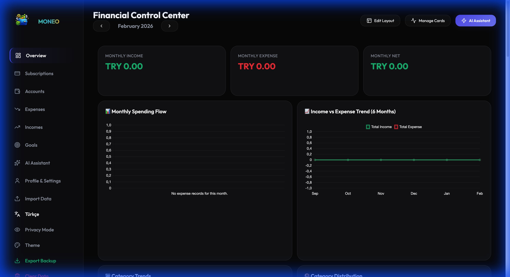
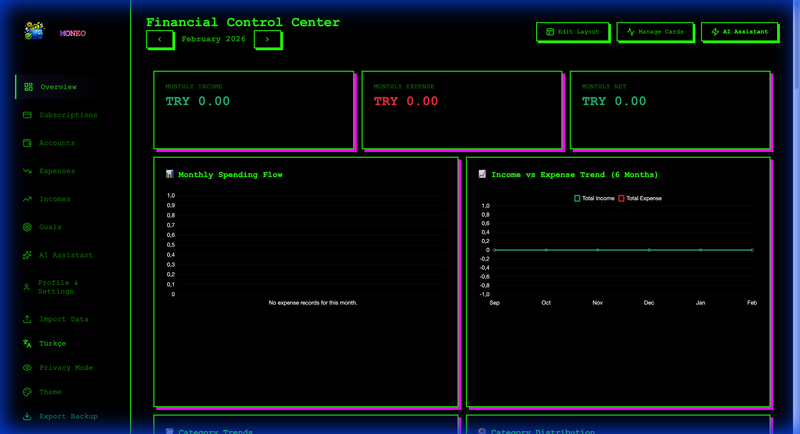
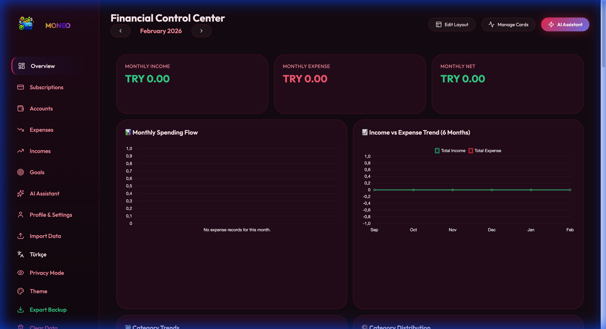

# 💰 Moneo - Personal Finance Dashboard

[](https://moneo-finance-dashboard.vercel.app/)
[](LICENSE)
[](https://react.dev/)

**Moneo** is a modern, privacy-first personal finance dashboard designed to give you complete control over your money. It operates 100% offline using your browser's local storage, ensuring your sensitive financial data never leaves your device unless you explicitly choose to analyze it with AI.



## ✨ Features

-   **🔒 Privacy First:** All data is stored locally in your browser (`localStorage`). No servers, no tracking.
-   **🤖 Multi-Provider AI Assistant:** Analyze your finances with the power of **Google Gemini**, **OpenAI (GPT)**, **Anthropic (Claude)**, or **DeepSeek**.
-   **📄 Smart PDF Import:** Drag & drop your bank statement PDFs. Moneo uses AI to automatically extract transactions and categorize them.
-   **📊 Interactive Dashboard:** Customizable grid layout with drag-and-drop widgets.
-   **📈 Predictive Analytics:**
    -   Daily Heatmap (Visual spending intensity)
    -   Budget Depletion Forecast
    -   Next Month Expense Prediction
    -   Goal Completion Estimator
-   **🎨 Personalization:** Multiple themes (Dark, Light, Neon, Sunset) and a custom color generator.
-   **🌍 Localization:** Full support for English and Turkish languages.

---

## 🚀 Getting Started

You can use the [Live Demo](https://moneo-finance-dashboard.vercel.app/) immediately, or run it locally on your machine for development.

### Prerequisites

-   Node.js (v18 or higher)
-   npm or yarn

### Installation

1.  **Clone the repository**
    ```bash
    git clone https://github.com/recepzgrmh/my-financial-report.git
    cd my-financial-report
    ```

2.  **Install dependencies**
    ```bash
    npm install
    ```

3.  **Start the development server**
    ```bash
    npm run dev
    ```

4.  Open your browser and navigate to `http://localhost:5173`.

---

## 💡 How to Use

### 1. Import Your Data
Go to the **Import Data** page. You can:
-   Upload a generic Bank Statement PDF.
-   Select your preferred AI Provider (Gemini, OpenAI, Claude, DeepSeek) to parse the PDF.
-   Moneo will detect the bank, categorize transactions, and populate your dashboard.



### 2. Analyze with AI
Visit the **AI Assistant** page to chat with your financial data.
-   Ask questions like *"How can I save more this month?"* or *"Analyze my spending habits."*
-   Switch between different AI models to get the best advice.



### 3. Customize Your View
-   Click **"Edit Layout"** on the dashboard to resize or move cards.
-   Use the **Theme** selector in the sidebar to match your style.

---

## 🎨 Style Gallery

Moneo comes with multiple built-in themes to match your mood.

| Cosmic Glass (Default) | Profesyonel (Light) |
|:---:|:---:|
|  |  |
| **Neon Punk** | **Sunset Bliss** |
|  |  |

---

## 🤖 The AI Experiment

> **Disclaimer:** This project is a collaborative experiment between Human and AI.

While the **architecture, file structure, tech stack, and core application logic** were fully designed and directed by the human creator, the **implementation details, code generation, CSS styling, and even this README file** were executed by Artificial Intelligence.

The goal of this project was to run a real-world experiment: **to explore how far AI-assisted development can go when guided by a clear human vision, even within a language or framework not fully mastered by the creator.**

Moneo stands as a proof of concept for the future of software development:
**Human vision. AI execution.**

---

## 🛠️ Contributing

We welcome contributions! Moneo is an open-source project and we'd love to see it grow.

### Areas for Improvement
-   [ ] **Mobile App:** A React Native version for mobile.
-   [ ] **More Bank Formats:** Improve PDF parsing prompts for more international banks.
-   [ ] **Budgeting Rules:** Add 50/30/20 rule visualizations.
-   [ ] **Export:** Add CSV/Excel export functionality.

### Steps to Contribute
1.  Fork the repository.
2.  Create a new branch (`git checkout -b feature/AmazingFeature`).
3.  Commit your changes (`git commit -m 'Add some AmazingFeature'`).
4.  Push to the branch (`git push origin feature/AmazingFeature`).
5.  Open a Pull Request.

---

## 🤖 The AI Experiment

> **Disclaimer:** This entire project—including all code, design decisions, CSS styling, and even this README—was generated by Artificial Intelligence.

The purpose of this project was to conduct a comprehensive experiment: **To see how far AI-assisted coding could go in building a complex, full-stack application in a language and framework completely unknown to the creator.** 

Moneo serves as a proof of concept for the future of software development, where AI acts not just as a helper, but as a core architect and builder.

---

## 📄 License

Distributed under the MIT License. See `LICENSE` for more information.

---

<p align="center">
  Built with ❤️ by <a href="https://github.com/recepzgrmh">Recep</a>
</p>
